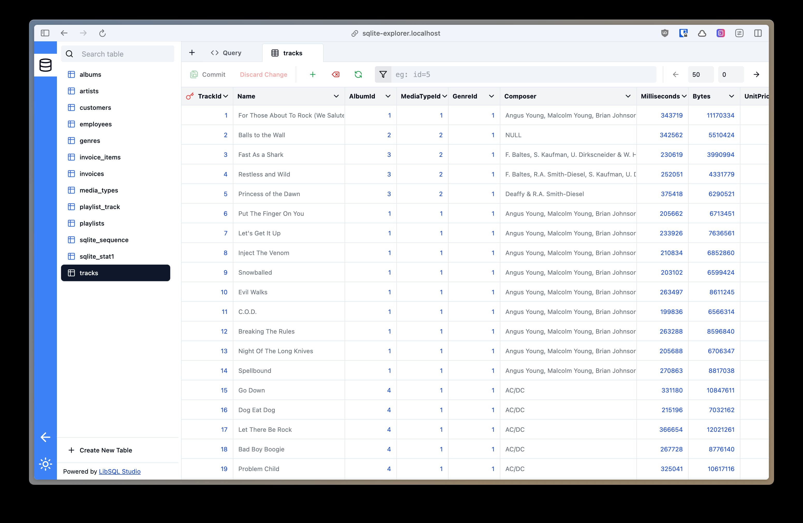

# SQLite Explorer

SQLite Exporer allows you to serve a SQLite database over HTTP.

It includes:

- A web interface to browse the database
- A REST API to query the database
- A CLI to serve local databases
- A client library to interact with the REST API

## Initialization

Create a `mod.ts` file:

```ts
import { serveDatabase } from "jsr:@pomdtr/sqlite-explorer@0.3.0/server";
import { basicAuth } from "https://esm.town/v/pomdtr/basicAuth?v=66";

export default {
    fetch: basicAuth(
        (req: Request) => serveDatabase(req, { dbPath: "./chinook.db" }),
        {
            verifyUser: (_user, password) => {
                return password == Deno.env.get("PASSWORD");
            },
        },
    ),
};
```

Then run: `deno run -A mod.ts`

Or use the cli:

```sh
deno run @pomdtr/sqlite-explorer chinook.db
```

## Web Interface

Sqlite Explorer embeds [LibSQL Studio](https://libsqlstudio.com/), a web interface to browse SQLite databases.



## Client Library

```ts
import { createClient } from "jsr:@pomdtr/sqlite-explorer/client";

const client = createClient({
  url: "https://chinook.pomdtr.me",
});

export default async function() {
  const res = await client.execute("SELECT name FROM artists");
  return Response.json(rows);
}
```
